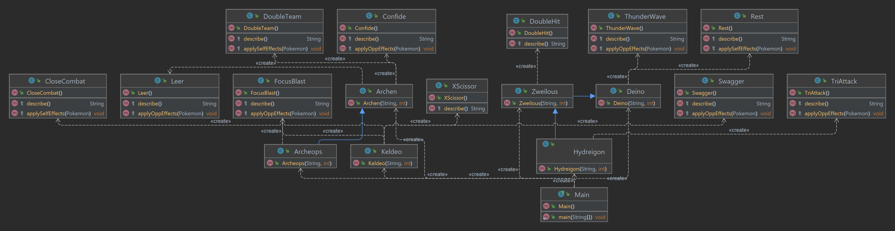

### «Национальный исследовательский университет ИТМО»

### Факультет программной инженерии и компьютерной техники
### Направление подготовки: 09.03.01 -Информатика и вычислительная техника, Компьютерные системы и технологии
### Дисциплина «Программирование»

### Отчет по программированию
### Лабораторная работа № 2
### Вариант 333888
#### Хабнер Георгий, P3131

#### г. Санкт-Петербург, 2022г.

## 1. Текст задания
На основе базового класса Pokemon написать свои классы для заданных видов покемонов. Каждый вид покемона должен иметь один или два типа и стандартные базовые характеристики:

Классы покемонов должны наследоваться в соответствии с цепочкой эволюции покемонов. На основе базовых классов PhysicalMove, SpecialMove и StatusMove реализовать свои классы для заданных видов атак.

Атака должна иметь стандартные тип, силу (power) и точность (accuracy). Должны быть реализованы стандартные эффекты атаки. Назначить каждому виду покемонов атаки в соответствии с вариантом. Уровень покемона выбирается минимально необходимым для всех реализованных атак.

Используя класс симуляции боя Battle, создать 2 команды покемонов (каждый покемон должен иметь имя) и запустить бой.

## 2. Код программы
>https://github.com/SugarBooba/Programming/tree/master/lab1/src
>
## 3. Результат выполнения
>Keldeo Bob из команды фиолетовых вступает в бой!
Deino Litty из команды белых вступает в бой!
Keldeo Bob сражается с врагом в ближнем бою, не защищаясь. 
Критический удар!
Deino Litty теряет 685 здоровья.
Deino Litty теряет сознание.
Zweilous Artur из команды белых вступает в бой!
Keldeo Bob усиливает ментальную сосредоточенность и высвобождает силу. 
Критический удар!
Zweilous Artur теряет 6873 здоровья.
Zweilous Artur теряет сознание.
Hydreigon Loli из команды белых вступает в бой!
Keldeo Bob усиливает ментальную сосредоточенность и высвобождает силу. 
Hydreigon Loli теряет 2648 здоровья.
Hydreigon Loli теряет сознание.
В команде белых не осталось покемонов.
Команда фиолетовых побеждает в этом бою!

## 4. Диаграмма классов реализованной объектной модели

## 5. Вывод
В ходе работы я познакомился с реализацией и устройством ООП в java, научился наследоваться от классов и переопределять наследуемые методы.