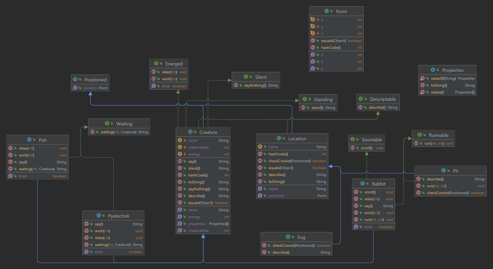

### «Национальный исследовательский университет ИТМО»

### Факультет программной инженерии и компьютерной техники
### Направление подготовки: 09.03.01 -Информатика и вычислительная техника, Компьютерные системы и технологии
### Дисциплина «Программирование»

### Отчет по программированию
### Лабораторная работа № 3
### Вариант 90003
#### Хабнер Георгий, P3131

#### г. Санкт-Петербург, 2022г.

## 1. Текст задания
Программа должна удовлетворять следующим требованиям:

1. Доработанная модель должна соответствовать принципам SOLID.
2. Программа должна содержать как минимум два интерфейса и один абстрактный класс (номенклатура  должна быть согласована с преподавателем).
3. В разработанных классах должны быть переопределены методы equals(), toString() и hashCode().
4. Программа должна содержать как минимум один перечисляемый тип (enum).

## 2. Код программы
>https://github.com/SugarBooba/Programming/tree/master/lab1/src
>
## 3. Результат выполнения

## 4. Диаграмма классов реализованной объектной модели

## 5. Вывод
В ходе работы я познакомился с принципами программирования SOLID и STUPID, узнал о необходиости использования интерфейсов и абстрактных классов и то, как можно сравнивать классы между собой. 