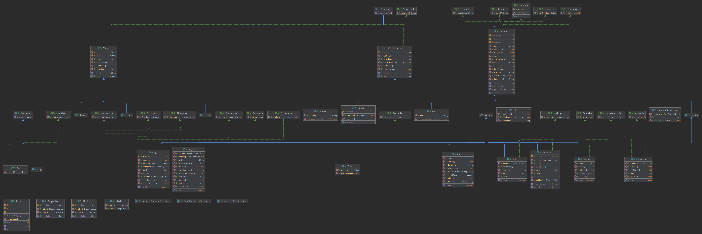

### «Национальный исследовательский университет ИТМО»

### Факультет программной инженерии и компьютерной техники
### Направление подготовки: 09.03.01 -Информатика и вычислительная техника, Компьютерные системы и технологии
### Дисциплина «Программирование»

### Отчет по программированию
### Лабораторная работа № 4
### Вариант 90003.8
#### Хабнер Георгий, P3131

#### г. Санкт-Петербург, 2022г.

## 1. Текст задания
Программа должна удовлетворять следующим требованиям:

1.В программе должны быть реализованы 2 собственных класса исключений (checked и unchecked), а также обработка исключений этих классов.
2.В программу необходимо добавить использование локальных, анонимных и вложенных классов (static и non-static).

## 2. Код программы
>https://github.com/SugarBooba/Programming/tree/master/lab3
>
## 3. Результат выполнения
>Загрузка истории 

Локация Kenga'sHouse сгенерирована
На свет появилась Строгая MamaKenga и её размер 10
На свет появился Дружественный KrohaRu и его размер 5
На свет появился Дружественный Tiger и его размер 145

MamaKenga успела приготовить: 
1. яйцо
2. хлеб
3. круасан

KrohaRu спокойно поел
съел яйцо
съел хлеб
съел круасан
Tiger спокойно поел
съел яйцо
съел хлеб
съел круасан
Tiger достиг максимального размера
Tiger немного переел
MamaKenga : Выметайтесь из дома

KrohaRu ушел в Forest
Tiger ушел в Forest
шишки есть
KrohaRu ушел в Kenga'sHouse
Tiger ушел в Kenga'sHouse
Tiger забыл Thing Basket под деревом, высота этого дерева 5
Дерево находится на координатах: 23,23,23

На свет появился Умный Robbi и его размер 10
Robbi внезапно появился в локации Kenga'sHouse
Tiger уселся есть
съел яблоко с корицей
съел хлеб с маслом
съел круасан
Tiger достиг максимального размера
Tiger немного переел
KrohaRu объяснил Tiger что не так с его бисквитным Кашлем
Tiger объяснил KrohaRu что-то интересное
MamaKenga объяснила Tiger не говорить вместе с KrohaRu
MamaKenga объяснила KrohaRu не говорить вместе с Tiger

Локация Pit сгенерирована
Локация Fog сгенерирована
На свет появился Грустный Puhi и его размер 10
На свет появился Умный Rabbi и его размер 10
На свет появился Маленькая Piggi и его размер 5
Этот Rabbi пока не догнал яму
Теперь я знаю, где мы!
Rabbi поработал. Его энгергия 80
Rabbi похудел от работы и теперь его вес 9
Этот Rabbi пока не догнал яму
Теперь я знаю, где мы!
Rabbi поработал. Его энгергия 60
Rabbi похудел от работы и теперь его вес 8
Этот Rabbi пока не догнал яму
Теперь я знаю, где мы!
Rabbi поработал. Его энгергия 40
Rabbi похудел от работы и теперь его вес 7
Этот Rabbi пока не догнал яму
Теперь я знаю, где мы!
Rabbi поработал. Его энгергия 20
Rabbi похудел от работы и теперь его вес 6
Этот Rabbi пока не догнал яму
Теперь я знаю, где мы!
Rabbi поработал. Его энгергия 0
Rabbi похудел от работы и теперь его вес 5
Rabbi слишком сильно устал
Puhi отдохнул
Piggi отдохнул

Robbi понял что не все дома!!!
Puhi Встал
Robbi нашел Piggi

Этот Tiger бегает кругами
Громко рыкнуул
Rabbi услышал voice
Rabbi побежал на голос
Rabbi настолько обрадовался видеть Tiger что теперь тот:
KIND, BIG, SAVING, BESTOFALL

Данные герои приняли участие в истории:
1) MamaKenga
2) KrohaRu
3) Tiger
4) Robbi
5) Puhi
6) Rabbi
7) Piggi
8) voice

## 4. Диаграмма классов реализованной объектной модели

## 5. Вывод
В ходе работы я познакомился с вложенными классами и принципом работы с ними, узнал как обрабатывать ошибки. Также изучил, как исследовать данные о программе с помощью рефлексии. 